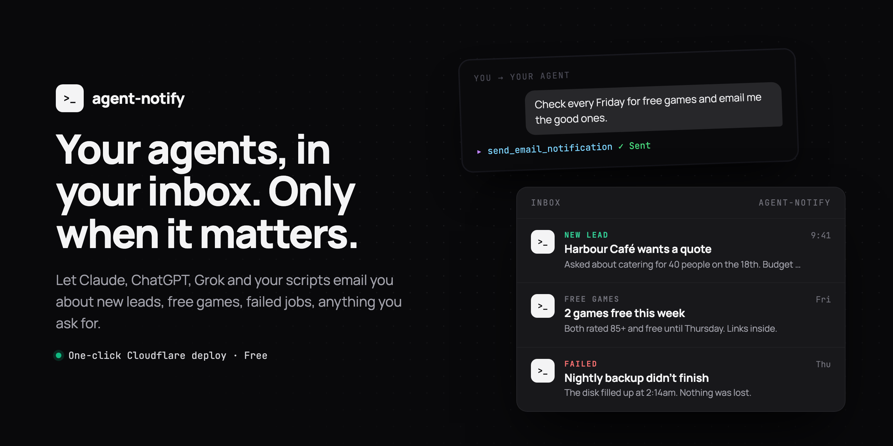
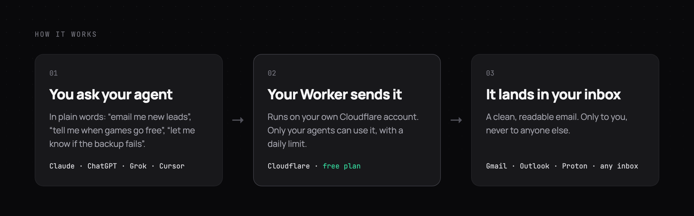
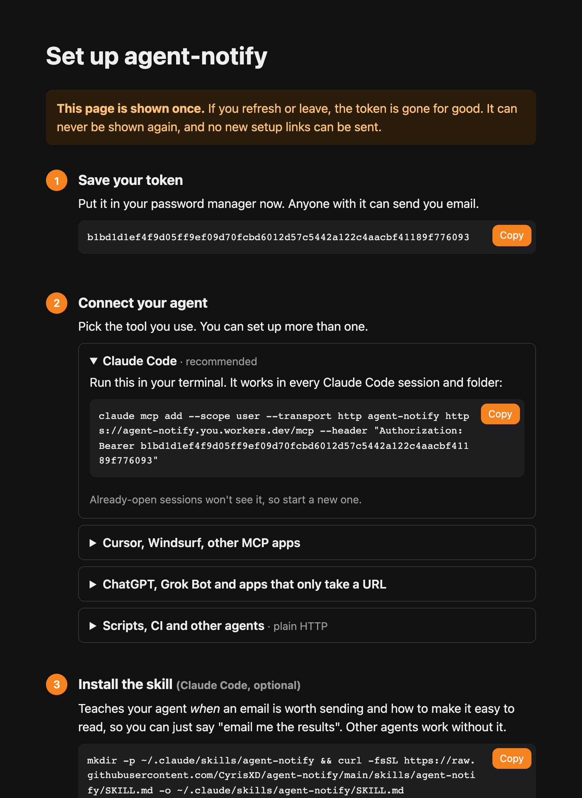

# agent-notify



Always-on agents like OpenAI Dots and Grok Bot now keep working after you close the app. agent-notify gives them, and Claude Code, Cursor and your scripts, a way to email you when something needs your attention: a new lead, free games this week, a failed backup, a finished report.

It's one Cloudflare Worker that you deploy to your own free account in one click, and it's private by design. Emails can only go to your inbox, and your access token is shown once and never stored in readable form. There's no shared service in the middle: it runs entirely on your own Cloudflare account.

**Works with** Claude Code, Cursor, Grok Bot, ChatGPT and OpenAI Dots (wherever custom connectors are available), and anything else that can use an MCP server or send a web request.

[](https://deploy.workers.cloudflare.com/?url=https://github.com/CyrisXD/agent-notify)



## Setup

**You need:** a free Cloudflare account, a domain on Cloudflare, and any inbox (Gmail, Proton, work email…). Nothing to install.

### 1. Prepare Cloudflare (once, 2 minutes)

1. [**Onboard your domain for sending**](https://dash.cloudflare.com/?to=/:account/email-service/sending): click **Onboard Domain** and pick your domain.
2. [**Verify your inbox**](https://dash.cloudflare.com/?to=/:account/email-service/routing): go to **Destination addresses**, add the address where you want alerts, and click the link Cloudflare emails you.

> **Domain already has email?** That's fine. Onboarding doesn't touch your MX records. If it offers a new DMARC record, keep your existing one if other tools send as your domain.

### 2. Deploy

Click **Deploy to Cloudflare** above and fill in:

- **`TO_ADDRESS`**: the inbox you verified
- **`FROM_ADDRESS`**: any address on your onboarded domain, e.g. `alerts@yourdomain.com`

### 3. Check your email

You'll get a one-time setup link. Open it, press **Reveal**, and follow the steps. **That page is shown once, so save your token.**



## Use it

Just ask your agent in plain words:

> Check the free games on Epic every Friday and email me the good ones.

> Watch my inbox for new leads and email me a one-line summary of each.

**ChatGPT, Grok Bot and other apps** that only accept a URL: add the secret MCP URL from your setup page as a custom connector with no authentication.

Or send from any script:

```bash
curl -X POST "$AGENT_NOTIFY_URL" \
  -H "Authorization: Bearer $AGENT_NOTIFY_TOKEN" \
  -H "Content-Type: application/json" \
  -d '{"subject":"Backup finished","text":"All 3 databases backed up."}'
```

## The skill

The connection lets your agent send email. The [agent-notify skill](skills/agent-notify/SKILL.md) teaches it to do that well.

- **Knows when to email.** It always sends when you ask, and otherwise only for things you'd want to know about now: what you asked it to watch for, failures, decisions waiting on you, finished long jobs. It skips routine progress and doesn't repeat itself.
- **Writes emails that are easy to read.** Alerts are short: a clear subject like `[FAILED] nightly backup`, what happened and what to do next. Digests you ask for (this week's free games, new leads, a report) can be as long as they need, laid out item by item with links so they're easy to skim on a phone.
- **Stays safe.** It never puts passwords, tokens or secrets in an email, and it stops (rather than retrying) when the daily limit is reached.

Install it in Claude Code with one command (also shown on your setup page):

```bash
mkdir -p ~/.claude/skills/agent-notify && curl -fsSL https://raw.githubusercontent.com/CyrisXD/agent-notify/main/skills/agent-notify/SKILL.md -o ~/.claude/skills/agent-notify/SKILL.md
```

Then just mention email ("email me when it's done") or call it directly:

```
/agent-notify find this week's free games and email me the best three
```

The skill is a plain Markdown file, so other agents that support skills or custom instructions can use it too.

## Cost

**Free.** On Cloudflare's free plan it can't cost anything: going over a limit just pauses sending until the next day.

On the $5 Workers Paid plan, emails to your verified inbox are still free, and `DAILY_LIMIT` (default 100 a day) keeps you inside the included quota. If you're on Paid, [set a budget alert](https://developers.cloudflare.com/billing/manage/budget-alerts/) anyway.

## Security

- Only you receive the emails: the recipient is fixed when you deploy, so callers can't choose who gets them.
- Your token is shown once and never emailed. Only its hash is stored.
- Setup happens once. Links only go to your inbox, expire in an hour, and stop working the moment your token is revealed. Nobody can reset or replace it afterwards.
- Lost or leaked token? Delete the Worker in Cloudflare and deploy again for a fresh one.

<details>
<summary><b>Troubleshooting</b></summary>

- **"email sending not authorized":** your `FROM_ADDRESS` domain isn't onboarded (step 1). Fix it, wait a few minutes, then open your Worker's URL and click **Email me a setup link**. No redeploy needed.
- **Need to change `TO_ADDRESS`, `FROM_ADDRESS` or `DAILY_LIMIT`?** Edit `wrangler.jsonc` in the copy of this repo that Cloudflare created on your GitHub. Committing redeploys it. Don't change them in the Cloudflare dashboard: the next deploy resets them.
- **No setup email:** check spam, then request one from your Worker's URL.
- **Claude Code says the tool isn't available:** run `claude mcp list`. If `agent-notify` is missing, re-run the command from your setup page (it uses `--scope user`, so it works in every folder).
- **Build fails with "build token … deleted or rolled":** Worker → **Settings → Builds → API token → Create new token**, then **Retry build**.
- **429 "Daily email limit reached":** resets at 00:00 UTC. To raise it, change `DAILY_LIMIT` (see above).

</details>

<details>
<summary><b>Deploy from the command line instead</b></summary>

```bash
git clone https://github.com/CyrisXD/agent-notify && cd agent-notify && npm i
# set TO_ADDRESS and FROM_ADDRESS in wrangler.jsonc
npm run deploy
```

</details>

MIT licensed.

If agent-notify saves you some time, you can buy me a coffee:

<a href="https://buymeacoffee.com/FiRmVXOZh"></a>
